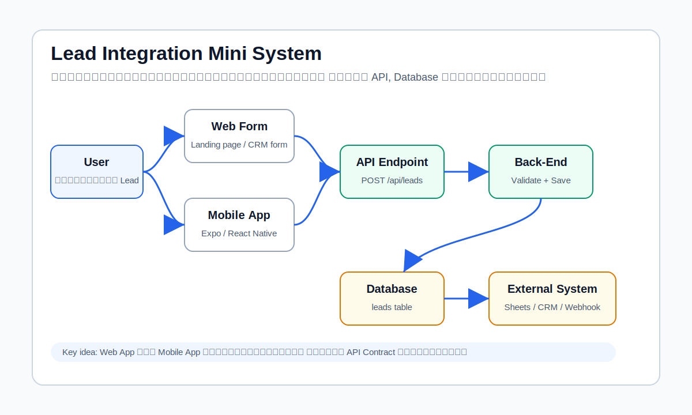
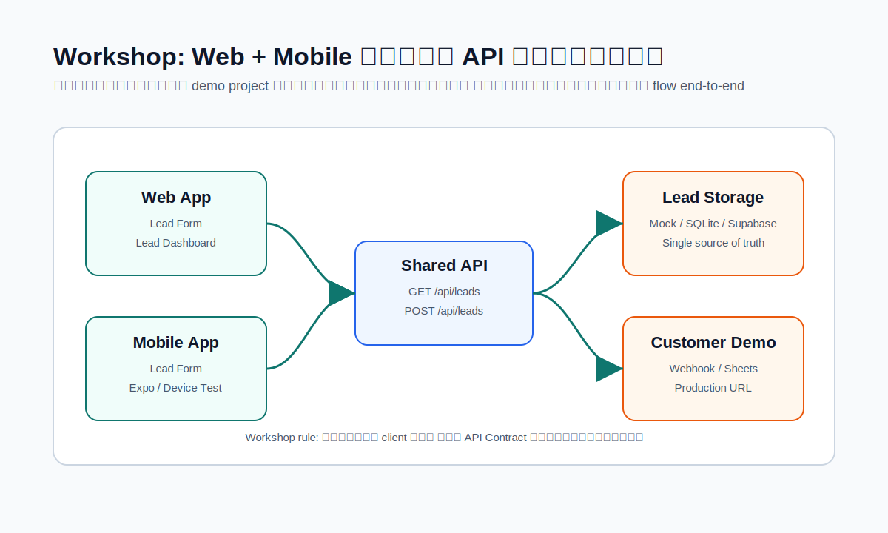
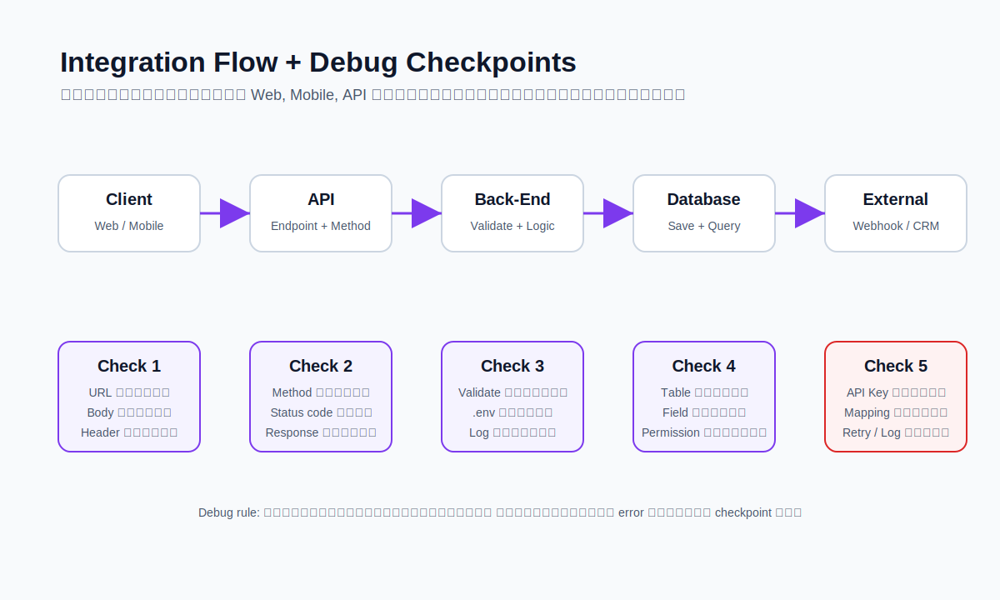

# ร่างปรับเนื้อหาแบบหนังสือ: API Integration for Web & Mobile App

เอกสารนี้เป็นร่างสำหรับตรวจทิศทางก่อนนำไปแทนเนื้อหาจริงบนเว็บไซต์ แบ่งเป็น 2 ส่วน:

1. รอบที่ 1: โครงสารบัญใหม่แบบหนังสือ แต่ยังเหมาะกับการสอน 1 วัน
2. รอบที่ 2: ตัวอย่างเนื้อหาขยาย บทที่ 1 และบทที่ 2

แนวคิดหลักคือทำให้เอกสารอ่านเองได้ แต่ยังใช้สอนสดได้จริง ไม่ยาวจนเกินเวลาคอร์ส 1 วัน

---

## รอบที่ 1: โครงสารบัญใหม่แบบหนังสือ

### ภาพรวมแนวทาง

คอร์สนี้ควรเป็นเอกสารแบบ "คู่มือทำงานจริง" มากกว่าเอกสารทฤษฎี API เพราะโจทย์ของผู้เรียนคือเข้าใจระบบที่ได้รับมา รันให้ได้ Debug ให้เป็น และเชื่อมข้อมูลระหว่างเว็บ แอพ และระบบภายนอกได้

เนื้อหาจึงควรยึดโปรเจกต์ตัวอย่างเดียวตลอดคอร์ส:

**Lead Integration Mini System**

ระบบตัวอย่างนี้มี 2 หน้าหลัก:

- **Lead Form** สำหรับกรอกข้อมูลลูกค้าที่สนใจบริการ
- **Lead Dashboard** สำหรับดูรายการ Lead และสถานะ

และมี 2 client:

- **Web App** สำหรับใช้งานผ่าน browser
- **Mobile App** สำหรับใช้งานผ่านมือถือ

ทั้ง Web App และ Mobile App จะเรียกใช้ API ชุดเดียวกัน จากนั้น Back-End จะบันทึกข้อมูลลง Database และส่งข้อมูลต่อไปยังระบบภายนอก เช่น Google Sheets, CRM, LINE Notification หรือ Webhook

รูปประกอบที่ควรใช้:



### โครงเวลา 1 วัน

เวลาสอนจริงควรควบคุมไม่ให้กลายเป็นคอร์ส 2-3 วัน ดังนั้นแต่ละบทต้องมีระดับความละเอียดพออ่านเข้าใจ แต่ workshop ต้องเลือกทำเฉพาะแกนหลัก ไม่ทำทุก integration พร้อมกัน

| เวลา | บท | เป้าหมาย |
|---|---|---|
| 10:00-10:30 | บทที่ 1: ภาพรวมระบบและ Case Study | เห็นภาพระบบทั้งหมดก่อนลงรายละเอียด |
| 10:30-11:15 | บทที่ 2: API Integration Overview | เข้าใจบทบาท Front-End, Back-End, Database, API และ External System |
| 11:15-12:00 | บทที่ 3: Request, Response และ Status Code | อ่าน API request/response ได้ และทดสอบด้วย Postman |
| 13:00-13:45 | บทที่ 4: Web App เรียก API | ทำ Web Form ส่งข้อมูลเข้า API และแสดงผลบน Dashboard |
| 13:45-14:30 | บทที่ 5: Mobile App เรียก API เดียวกัน | ให้ Mobile App ใช้ API ชุดเดียวกับ Web App และเข้าใจปัญหา localhost |
| 14:30-15:15 | บทที่ 6: Installation และ Debug Playbook | รับโปรเจกต์มาแล้วรัน แก้ปัญหา และตรวจทีละจุดได้ |
| 15:15-16:15 | บทที่ 7: Interface Data ไปยังระบบภายนอก | ทำ Data Mapping และส่ง Lead ไป Google Sheets หรือ Webhook |
| 16:15-16:45 | บทที่ 8: Deploy และ Production Testing | Deploy แล้วทดสอบ URL จริง, API จริง, Environment จริง |
| 16:45-17:00 | บทที่ 9: สรุปและเอกสารส่งมอบ | สรุป checklist, README, API Contract, Debug Note |

หมายเหตุ: จากเดิมมี 11 บท ผมเสนอรวมบางบทเพื่อให้เหมาะกับคอร์ส 1 วัน:

- รวม Installation และ Debug เข้าด้วยกัน เพราะในงานจริงมักเกิดพร้อมกัน
- รวม Final Checklist และ Appendix เป็นบทส่งท้าย/เอกสารส่งมอบ
- คงเนื้อหา Deploy ไว้ แต่ทำให้กระชับ ไม่ลงลึก CI/CD

### โครงบทมาตรฐาน

แต่ละบทควรมีรูปแบบคงที่ เพื่อให้ผู้เรียนอ่านง่ายและคุณใช้สอนได้สะดวก:

1. **บทนี้เรียนไปเพื่ออะไร**
   อธิบายเหตุผลเชิงงานจริง เช่น "ทำไมต้องทดสอบ API แยกจากหน้าเว็บ"

2. **ภาพรวมแนวคิด**
   อธิบาย concept ด้วยภาษาคน ไม่เริ่มจากศัพท์เทคนิคทันที

3. **ตัวอย่างจาก Lead Integration Mini System**
   ใช้ case เดิมตลอดคอร์ส เพื่อให้ผู้เรียนไม่ต้องทำความเข้าใจโจทย์ใหม่ทุกบท

4. **Flow การทำงาน**
   มี diagram หรือ flow สั้น ๆ พร้อมอธิบายแต่ละ step

5. **สิ่งที่ต้องดูใน Code / Config / API**
   ชี้ไฟล์ ตัวแปร และ payload ที่เกี่ยวข้อง

6. **ข้อผิดพลาดที่พบบ่อย**
   บอกอาการ สาเหตุที่เป็นไปได้ และวิธีตรวจ

7. **Workshop**
   เป็นโจทย์ทำจริง พร้อม expected result

8. **สรุปท้ายบท**
   3-5 ข้อที่ผู้เรียนต้องจำ

### โครง Workshop ที่เหมาะกับเป้าหมายของคุณ

จากที่คุณบอกว่า "ต้องสร้างเว็บ และแอพให้ลูกค้าดู" ผมแนะนำให้ workshop เป็นแบบ **Demo Project ส่งมอบลูกค้าได้** ไม่ใช่แบบแบบฝึกหัดแยกส่วน

Workshop หลักควรชื่อ:

**Lead Capture Web + Mobile Demo**

สิ่งที่ผู้เรียนจะได้เห็นเป็นชิ้นงาน:

1. Web App มีหน้า Lead Form
2. Web App มีหน้า Lead Dashboard
3. Mobile App มีหน้า Lead Form แบบง่าย
4. ทั้ง Web และ Mobile เรียก API เดียวกัน
5. API บันทึกข้อมูลลง Database หรือ mock storage
6. API ส่งข้อมูลต่อไป Google Sheets หรือ Webhook
7. มี README, .env.example และ API Contract สำหรับส่งมอบ

รูปประกอบ workshop:



### Workshop ควรใช้ Stack แบบไหนดี

ถ้าเป้าหมายคือทำให้ลูกค้าดูได้และสอนได้จบใน 1 วัน ผมแนะนำ 2 ทางเลือก:

#### ทางเลือก A: ทำจบง่ายและเร็ว

- Web App: Next.js
- API: Next.js Route Handlers
- Database: เริ่มจาก in-memory/mock JSON หรือ SQLite
- Mobile App: Expo React Native
- External Integration: Webhook.site หรือ Google Sheets Webhook
- Deploy: Vercel เฉพาะ Web/API

ข้อดี:

- สอน Flow ได้ครบใน 1 วัน
- ลดเวลาติดตั้ง Database จริง
- เหมาะกับการ demo ให้ลูกค้าดู

ข้อเสีย:

- ถ้าใช้ mock storage จะยังไม่ใช่ production database จริง

#### ทางเลือก B: ใกล้งานจริงมากขึ้น

- Web App: Next.js
- API: Next.js Route Handlers
- Database: Supabase
- Mobile App: Expo React Native
- External Integration: Google Sheets หรือ LINE/Webhook
- Deploy: Vercel + Supabase

ข้อดี:

- ใกล้กับงานส่งมอบจริงกว่า
- ผู้เรียนเห็นการตั้งค่า API URL, DB URL, API Key ชัดเจน

ข้อเสีย:

- อาจใช้เวลาติดตั้งและ debug เยอะเกินคอร์ส 1 วัน ถ้าผู้เรียนพื้นฐานไม่เท่ากัน

คำแนะนำของผม:

ใช้ **ทางเลือก A เป็น workshop หลัก** และเตรียม **ทางเลือก B เป็นช่วงอธิบายต่อยอด** หรือเป็นไฟล์ bonus หลังคอร์ส

### Workshop Flow ที่ควรทำในวันเรียน

Workshop ไม่ควรกระจายเป็น 5 โปรเจกต์เล็ก แต่ควรเป็นโปรเจกต์เดียวที่ค่อย ๆ โตขึ้น:

1. เปิด Web App และ API
2. ทดสอบ `GET /api/leads` ด้วย Postman
3. ทดสอบ `POST /api/leads` ด้วย Postman
4. ส่งข้อมูลจาก Web Form เข้า API
5. แสดงข้อมูลใน Dashboard
6. เปิด Mobile App และชี้ API URL เดียวกัน
7. ส่ง Lead จาก Mobile App
8. เช็กว่า Lead จาก Web และ Mobile เข้า list เดียวกัน
9. ส่งข้อมูลต่อไป Webhook หรือ Google Sheets
10. Deploy Web/API แล้วเปลี่ยน Mobile App ให้เรียก Production URL

สิ่งที่ต้องเตรียมให้ผู้เรียน:

- Source code ตั้งต้น
- README แบบ step-by-step
- `.env.example`
- Postman collection หรือรายการ endpoint
- API Contract
- Debug checklist
- Webhook.site URL สำหรับทดสอบ integration

---

## รอบที่ 2: ตัวอย่างเนื้อหาขยาย

ส่วนนี้เป็นตัวอย่างว่า ถ้าขยายเป็นหนังสือ ระดับความละเอียดจะออกมาประมาณนี้ โดยยังคุมให้เหมาะกับคอร์ส 1 วัน

---

# บทที่ 1: ภาพรวมระบบและ Case Study

## บทนี้เรียนไปเพื่ออะไร

ก่อนลงมือเขียนโค้ดหรือทดสอบ API ผู้เรียนต้องเห็นภาพก่อนว่าระบบหนึ่งระบบประกอบด้วยอะไรบ้าง และแต่ละส่วนคุยกันอย่างไร

เวลาทำงานจริง เรามักไม่ได้เจอโค้ดแบบแยกสวย ๆ เป็นบทเรียน แต่จะเจอโปรเจกต์ที่มีหลายส่วนปนกัน เช่น หน้าเว็บ ฟอร์ม API database environment variables dashboard และระบบภายนอก ถ้ายังมองภาพรวมไม่ออก เวลาเกิดปัญหาจะไล่ยากมาก เพราะไม่รู้ว่าควรเริ่มตรวจจากจุดไหน

บทนี้จึงไม่ได้เน้นเขียนโค้ดทันที แต่เน้นสร้าง mental model ว่าเมื่อผู้ใช้กรอกฟอร์มหนึ่งครั้ง ข้อมูลเดินทางผ่านอะไรบ้าง ตั้งแต่หน้าเว็บหรือมือถือ ไปจนถึง database และระบบปลายทาง

## Case Study: Lead Integration Mini System

ตลอดคอร์สนี้เราจะใช้ระบบตัวอย่างเดียว คือ **Lead Integration Mini System**

ระบบนี้จำลองงานที่เจอได้บ่อยในธุรกิจจริง เช่น ลูกค้าเข้าหน้า landing page แล้วกรอกข้อมูลสนใจบริการทำเว็บไซต์ ทีมขายต้องเห็นข้อมูลใน dashboard และบางธุรกิจต้องการให้ข้อมูลเดียวกันถูกส่งต่อไปยัง Google Sheets, CRM หรือระบบแจ้งเตือน

ข้อมูล Lead ตัวอย่าง:

```json
{
  "name": "สมชาย ใจดี",
  "phone": "0890000000",
  "interest": "Website",
  "source": "Landing Page"
}
```

ข้อมูลชุดนี้ดูเรียบง่าย แต่ในระบบจริงมันทำให้เราเรียนรู้เรื่องสำคัญได้ครบ:

- Front-End ต้องรู้ว่าจะส่ง field อะไรไป API
- API ต้องรู้ว่า field ไหนจำเป็น และ field ไหน optional
- Back-End ต้อง validate ข้อมูลก่อนบันทึก
- Database ต้องมี schema รองรับข้อมูล
- Dashboard ต้องดึงข้อมูลกลับมาแสดง
- Mobile App ต้องส่งข้อมูลในรูปแบบเดียวกับ Web App
- External System ต้องรับข้อมูลที่ map ถูกต้อง

## ภาพรวมการเดินทางของข้อมูล

เมื่อผู้ใช้กรอกฟอร์ม Lead หนึ่งครั้ง ข้อมูลจะไม่ได้กระโดดจากหน้าเว็บไปถึง database ทันที แต่จะผ่านหลายชั้น:

```text
User
↓
Web Form หรือ Mobile App
↓
API Endpoint
↓
Back-End Logic
↓
Database
↓
Dashboard หรือ External System
```

อธิบายแต่ละส่วน:

**User** คือผู้ที่กรอกข้อมูล เช่น ลูกค้าที่สนใจบริการ

**Web Form / Mobile App** คือหน้าจอที่รับข้อมูลจากผู้ใช้ หน้าที่หลักคือเก็บ input ให้ครบ จัดข้อมูลเป็น JSON และส่งไปที่ API

**API Endpoint** คือจุดรับข้อมูล เช่น `POST /api/leads` เปรียบเหมือนประตูทางเข้าของระบบ

**Back-End Logic** คือส่วนที่ตรวจสอบข้อมูล ตัดสินใจว่าจะบันทึกหรือไม่ และจัดการงานที่ไม่ควรทำใน Front-End เช่น ใช้ secret key หรือส่งต่อข้อมูลไปยังระบบภายนอก

**Database** คือที่เก็บข้อมูลหลักของระบบ เพื่อให้ dashboard หรือ API อื่นดึงไปใช้ต่อได้

**Dashboard / External System** คือปลายทางที่มนุษย์หรือระบบอื่นใช้ข้อมูลนั้น เช่น ทีมขายดูรายการ Lead หรือระบบส่งแจ้งเตือนไปยังทีมงาน

## ทำไมต้องใช้ API เป็นตัวกลาง

ถ้า Web App ต้องบันทึกข้อมูลลง database โดยตรง หรือ Mobile App ต้องคุยกับ Google Sheets โดยตรง ระบบจะควบคุมยากและเสี่ยงเรื่องความปลอดภัย

API ช่วยแก้ปัญหาเหล่านี้:

- รวมกฎการรับข้อมูลไว้จุดเดียว
- ทำให้ Web App และ Mobile App ใช้ logic เดียวกัน
- ซ่อนข้อมูลสำคัญ เช่น Database URL หรือ Secret Key ไม่ให้หลุดไปฝั่งผู้ใช้
- ทำให้เปลี่ยนระบบปลายทางได้ง่ายขึ้น เช่น วันนี้ส่ง Google Sheets วันหน้าเปลี่ยนเป็น CRM
- ตรวจสอบ log และ error ได้เป็นระบบ

ตัวอย่าง:

ถ้า Web App และ Mobile App ส่งข้อมูลไปที่ `POST /api/leads` เหมือนกัน ทั้งสองแอพไม่จำเป็นต้องรู้ว่าเบื้องหลังบันทึกลง database แบบไหน หรือส่งต่อไป Google Sheets อย่างไร สิ่งที่ client ต้องรู้มีแค่ API Contract ว่าต้องส่งข้อมูลอะไร และจะได้ response แบบไหนกลับมา

## API Contract แบบเริ่มต้น

สำหรับระบบ Lead นี้ API Contract ขั้นต้นอาจเขียนได้แบบนี้:

```text
Endpoint: POST /api/leads
Purpose: สร้าง Lead ใหม่

Request Body:
- name: string, required
- phone: string, required
- interest: string, required
- source: string, optional

Success Response:
{
  "success": true,
  "message": "Lead created successfully",
  "data": {
    "id": 1,
    "name": "สมชาย ใจดี",
    "phone": "0890000000",
    "interest": "Website",
    "source": "Landing Page",
    "status": "new"
  }
}
```

ในคอร์สนี้ API Contract จะเป็นแกนสำคัญ เพราะเป็นข้อตกลงร่วมระหว่าง Web App, Mobile App, Back-End และระบบภายนอก

## สิ่งที่มักเข้าใจผิด

**เข้าใจผิดที่ 1: API คือ URL อย่างเดียว**

จริง ๆ แล้ว URL เป็นเพียงทางเข้า API แต่ API ยังรวมถึง method, headers, request body, response body, status code และ error format ด้วย

**เข้าใจผิดที่ 2: Web App กับ Mobile App ต้องมี API คนละชุด**

ไม่จำเป็น ถ้าออกแบบ API ดีตั้งแต่แรก Web App และ Mobile App สามารถใช้ API ชุดเดียวกันได้ เพียงแต่ UI และ runtime ต่างกัน

**เข้าใจผิดที่ 3: ถ้าหน้าเว็บ Error แปลว่า API เสีย**

ไม่เสมอไป ปัญหาอาจอยู่ที่ URL ผิด, method ผิด, body ไม่ตรง contract, header ไม่ครบ หรือ Front-End อ่าน response ผิด

## Workshop Preview

ใน workshop หลัก เราจะทำระบบให้เห็นครบ 4 ช่วง:

1. ทดสอบ API ด้วย Postman ก่อน
2. ให้ Web Form ส่ง Lead เข้า API
3. ให้ Mobile App ส่ง Lead เข้า API เดียวกัน
4. ส่งข้อมูลต่อไปยัง Webhook หรือ Google Sheets

สิ่งที่ต้องได้หลังจบบทนี้:

- อธิบายได้ว่าข้อมูล Lead เดินทางผ่านส่วนไหนบ้าง
- เข้าใจว่าทำไม API ต้องเป็นตัวกลาง
- เห็นภาพว่า Web App และ Mobile App ใช้ API ชุดเดียวกันได้อย่างไร
- เข้าใจว่า API Contract คือข้อตกลงที่ทุกฝั่งต้องใช้ร่วมกัน

---

# บทที่ 2: API Integration Overview

## บทนี้เรียนไปเพื่ออะไร

หลังจากเห็นภาพรวมของระบบแล้ว บทนี้จะลงรายละเอียดว่าแต่ละส่วนในระบบทำหน้าที่อะไร และทำไมการแยกบทบาทให้ชัดจึงสำคัญ

เวลาสร้างเว็บหรือแอพให้ลูกค้าดู สิ่งที่ลูกค้าเห็นคือหน้าจอ เช่น form, dashboard หรือ mobile screen แต่สิ่งที่ทำให้ระบบใช้งานได้จริงคือการเชื่อมต่อหลังบ้านทั้งหมด ถ้าเราเข้าใจแค่หน้าจอ แต่ไม่เข้าใจ API และข้อมูลที่วิ่งอยู่ข้างหลัง เวลาต้องแก้ปัญหาหรือส่งมอบงานจะลำบาก

## ส่วนประกอบหลักของระบบ

ระบบ Lead Integration Mini System มีส่วนประกอบหลักดังนี้:

```text
Web App
Mobile App
API
Back-End Logic
Database
External System
```

แต่ละส่วนมีหน้าที่ต่างกัน

### Front-End / Web App

Front-End คือส่วนที่ผู้ใช้เห็นและกดใช้งาน ในระบบตัวอย่างนี้คือ Lead Form และ Lead Dashboard

หน้าที่ของ Web App:

- แสดงฟอร์มให้ผู้ใช้กรอกข้อมูล
- เก็บ input จากผู้ใช้
- ตรวจข้อมูลเบื้องต้น เช่น ช่อง name หรือ phone ว่างหรือไม่
- สร้าง request body เป็น JSON
- เรียก API ด้วย method ที่ถูกต้อง
- แสดง loading, success และ error state
- ดึงข้อมูลจาก API มาแสดงใน dashboard

จุดสำคัญคือ Front-End ไม่ควรทำงานที่ต้องใช้ความลับ เช่น ใส่ Secret Key หรือเรียก API ภายนอกที่ต้องใช้ private token โดยตรง เพราะโค้ดฝั่ง Front-End มีโอกาสถูกเปิดดูได้

### Mobile App

Mobile App ทำหน้าที่คล้าย Web App คือรับข้อมูลจากผู้ใช้และเรียก API แต่มีข้อจำกัดเพิ่มเติม เช่น:

- ไม่มี browser URL เหมือน Web App
- การเรียก `localhost` มีความหมายต่างจากบนคอมพิวเตอร์
- ต้องทดสอบกับ emulator, simulator หรือมือถือจริง
- อาจเจอปัญหา network permission
- ต้องจัดการ API URL ตาม environment ให้ดี

หลักคิดสำคัญคือ Mobile App ไม่ควรมี business logic แยกจาก Web App โดยไม่จำเป็น ถ้าเป็นการสร้าง Lead เหมือนกัน ควรเรียก API เดียวกันและใช้ contract เดียวกัน

รูปประกอบ:


### API

API คือช่องทางที่ client ใช้คุยกับระบบหลังบ้าน ในระบบนี้ endpoint สำคัญคือ:

```text
GET /api/leads
POST /api/leads
PATCH /api/leads/:id
```

API ไม่ได้มีหน้าที่แค่รับส่งข้อมูล แต่ต้องกำหนดข้อตกลงให้ชัด เช่น:

- endpoint คืออะไร
- ใช้ method อะไร
- ต้องส่ง headers อะไร
- request body ต้องมี field อะไร
- response จะมีรูปแบบอย่างไร
- error จะตอบกลับอย่างไร

ตัวอย่าง response ที่ดีควรอ่านง่ายและคาดเดาได้:

```json
{
  "success": false,
  "message": "Phone is required",
  "error": {
    "field": "phone",
    "code": "REQUIRED_FIELD"
  }
}
```

ถ้า error response ไม่ชัด Front-End และ Mobile App จะจัดการ error ยาก และคน debug ก็ต้องเสียเวลามากขึ้น

### Back-End Logic

Back-End Logic คือส่วนที่อยู่หลัง API Endpoint ทำหน้าที่ตัดสินใจและจัดการข้อมูล

ใน `POST /api/leads` Back-End อาจทำงานตามลำดับนี้:

1. รับ request body
2. ตรวจว่า name, phone และ interest ครบหรือไม่
3. ปรับรูปแบบข้อมูล เช่น trim ช่องว่าง
4. บันทึกข้อมูลลง database
5. ส่งข้อมูลต่อไปยัง webhook หรือ Google Sheets
6. ส่ง response กลับไปยัง client

จุดที่ต้องระวังคือไม่ควรผูกงานทุกอย่างให้ล้มพร้อมกันโดยไม่คิด เช่น ถ้าบันทึก Lead ลง database สำเร็จ แต่ส่ง Google Sheets ไม่สำเร็จ ระบบควรตอบอย่างไร ต้องมี log ไหม ต้อง retry ไหม ประเด็นนี้จะไปลงรายละเอียดในบท Interface Data

### Database

Database คือแหล่งเก็บข้อมูลหลักของระบบ ในระบบ Lead อาจมี table ชื่อ `leads`

ตัวอย่าง schema เบื้องต้น:

```text
leads
- id
- name
- phone
- interest
- source
- status
- created_at
```

สำหรับคอร์ส 1 วัน ไม่จำเป็นต้องลงลึกเรื่อง database design มาก แต่ผู้เรียนควรเข้าใจว่า API และ database ต้องคุยกันผ่าน field ที่ตรงกัน ถ้า API ส่ง `phone` แต่ database ใช้ `tel` ต้องมีการ mapping หรือแปลงชื่อ field ให้ถูก

### External System

External System คือระบบปลายทางที่อยู่นอก app ของเรา เช่น:

- Google Sheets
- CRM
- LINE Notification
- ERP
- Webhook

ระบบเหล่านี้มักมี API Contract ของตัวเอง ดังนั้นข้อมูลที่เราเก็บในระบบเราอาจไม่ตรงกับข้อมูลที่ปลายทางต้องการ 100%

ตัวอย่าง:

```text
ระบบเราใช้: name, phone, interest
Google Sheets ต้องการ: full_name, mobile_number, service
```

จุดนี้คือที่มาของ Data Mapping ซึ่งเป็นหัวข้อสำคัญในงาน integration

## Flow หลักของระบบ

```text
Web App / Mobile App
↓
API Endpoint
↓
Back-End Logic
↓
Database
↓
Response กลับไปที่ Client
```

อ่าน flow นี้แบบงานจริง:

1. ผู้ใช้กรอกฟอร์มบน Web หรือ Mobile
2. Client สร้าง JSON payload
3. Client เรียก API เช่น `POST /api/leads`
4. API ส่งข้อมูลเข้า Back-End Logic
5. Back-End ตรวจและบันทึกข้อมูล
6. Back-End ส่ง response กลับ
7. Client ใช้ response เพื่อแสดงผลสำเร็จหรือ error

## Flow การส่งข้อมูลออกไปอีกระบบ

```text
Lead Form
↓
Back-End API
↓
Database
↓
Google Sheets / CRM / Webhook / Notification
```

คำถามที่ต้องตอบให้ได้ก่อนเชื่อมระบบภายนอก:

- ส่งข้อมูลไปที่ไหน
- ปลายทางต้องการ field อะไร
- ต้องใช้ API Key หรือ Token ไหม
- ถ้าส่งไม่สำเร็จจะทำอย่างไร
- ต้องเก็บ log ไหม
- ต้องแจ้งเตือนใครหรือไม่

รูปประกอบ:



## Key Concept: API คือข้อตกลง ไม่ใช่แค่ URL

ประโยคนี้ควรย้ำตลอดคอร์ส:

> API คือข้อตกลงกลางว่าระบบหนึ่งจะส่งข้อมูลอะไร ไปที่ไหน ด้วยรูปแบบไหน และจะได้รับคำตอบกลับมาอย่างไร

ถ้า API Contract ชัด ทุกฝั่งทำงานง่ายขึ้น:

- Front-End รู้ว่าจะส่ง payload แบบไหน
- Mobile App ใช้ logic เดียวกับ Web ได้
- Back-End validate ข้อมูลได้ตรงจุด
- คนทดสอบ API รู้ expected result
- คน debug แยกปัญหาได้เร็วขึ้น
- คนส่งมอบงานเขียนเอกสารได้ชัดขึ้น

## Workshop ในบทนี้

ยังไม่ต้องเขียน integration เต็ม ให้ทำความเข้าใจและตรวจ API Contract ก่อน

โจทย์:

1. อ่าน endpoint ต่อไปนี้

```text
POST /api/leads
```

2. เขียน request body ที่คิดว่าถูกต้อง

```json
{
  "name": "สมชาย ใจดี",
  "phone": "0890000000",
  "interest": "Website",
  "source": "Web Form"
}
```

3. ระบุว่า field ไหน required และ field ไหน optional

| Field | Required | เหตุผล |
|---|---|---|
| name | yes | ต้องรู้ชื่อลูกค้า |
| phone | yes | ทีมขายต้องติดต่อกลับ |
| interest | yes | ต้องรู้ว่าลูกค้าสนใจบริการอะไร |
| source | no | ใช้วิเคราะห์แหล่งที่มา แต่ระบบยังทำงานได้ถ้าไม่มี |

4. เขียน response success ที่คาดหวัง

5. เขียน response error กรณีไม่ส่ง phone

Expected result:

ผู้เรียนควรอธิบายได้ว่า API นี้ต้องการข้อมูลอะไร และเมื่อข้อมูลไม่ครบควรตอบ error อย่างไร

## สรุปท้ายบท

- Front-End และ Mobile App เป็น client ที่เรียก API
- API เป็นข้อตกลงกลางระหว่าง client กับระบบหลังบ้าน
- Back-End Logic เป็นที่ตรวจข้อมูล บันทึกข้อมูล และเชื่อมระบบภายนอก
- Database เป็นแหล่งข้อมูลหลักของระบบ
- External System ต้องมี Data Mapping และ Error Handling ที่ชัดเจน
- Workshop หลักของคอร์สควรใช้ API ชุดเดียวกันทั้ง Web และ Mobile เพื่อให้เห็นภาพงานจริง

---

## ข้อเสนอสำหรับรูปประกอบเพิ่มเติม

รูปที่ควรมีในเวอร์ชันเต็ม:

1. ภาพรวมระบบ Lead Integration
2. Web App และ Mobile App เรียก API เดียวกัน
3. Anatomy ของ HTTP Request / Response
4. Localhost บนคอมกับมือถือจริง
5. Debug decision tree
6. Data Mapping จาก System A ไป System B
7. Deploy flow จาก local ไป production

ในรอบนี้ผมทำตัวอย่างไว้ 3 รูปก่อน เพื่อใช้ตรวจ direction:

- `public/course-assets/api-integration-system-overview.svg`
- `public/course-assets/web-mobile-shared-api-workshop.svg`
- `public/course-assets/integration-debug-flow.svg`

